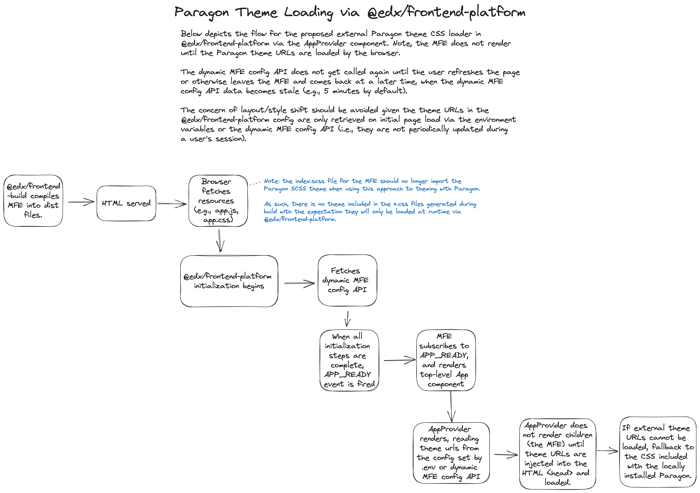

# Theming support with `@openedx/paragon` and `@openedx/brand-openedx`

> [!IMPORTANT]  
> This document describes theming with design tokens.
>
> Information on theming MFEs that do not yet have design tokens support:
>
> - <https://github.com/openedx/brand-openedx>
>
> Information on the design tokens project:
>
> - <https://github.com/openedx/paragon/blob/master/docs/decisions/0019-scaling-styles-with-design-tokens.rst>
> - <https://github.com/openedx/paragon/tree/alpha?tab=readme-ov-file#design-tokens>

## Overview

This document is a guide for using `@openedx/frontend-base` to support
theming with Paragon by loading branded CSS externally (e.g., from a CDN).

To do this, configured URLs pointing to relevant CSS files from
`@openedx/brand-openedx` are loaded and injected to the HTML document at
runtime. This differs from importing the styles from `@openedx/brand-openedx`
directly, which includes these styles in the application's production assets.

This override mechanism works by compiling the design tokens defined in
`@openedx/brand-openedx` with the core Paragon tokens to generate overrides to
Paragon's default CSS variables and then compiling the output CSS with any SCSS
theme customizations not possible through a design token override.

The CSS urls for `@openedx/brand-openedx` overrides will be applied after the
core Paragon theme urls load, thus overriding any previously set CSS variables
and/or styles.

By serving brand CSS loaded externally, consuming applications of Paragon no
longer need to be responsible for compiling the brand SCSS to CSS themselves
and instead use a pre-compiled CSS file. In doing so, this allows making
changes to the site theme without needing to necessarily re-build and re-deploy
all consuming applications.

### Dark mode and theme variant preferences

`@openedx/frontend-base` supports both `light` (required) and `dark` (optional)
theme variants. The choice of which theme variant should be applied on page load
is based on the following preference cascade:

1. **Get theme preference from localStorage.** Supports persisting and loading
   the user's preference for their selected theme variant, until cleared.
1. **Detect user system settings.** Rely on the `prefers-color-scheme` media
   query to detect if the user's system indicates a preference for dark mode. If
   so, use the default dark theme variant, if one is configured.
1. **Use the default theme variant as configured (see below).** Otherwise, load
   the default theme variant as configured by the `defaults` option described
   below.

Whenever the current theme variant changes, an attribute
`data-paragon-theme-variant="*"` is updated on the `<html>` element. This
attribute enables applications both JS and CSS to have knowledge of the
currently applied theme variant.

### Supporting custom theme variants beyond `light` and `dark`

If your use case requires additional variants beyond the default `light` and
`dark` theme variants, you may pass any number of custom theme variants. Custom
theme variants will work via the user's persisted localStorage setting (i.e., if a
user switches to a custom theme variant, the app will continue to load the
custom theme variant by default). By supporting custom theme variants, it also
supports having multiple or alternative `light` and/or `dark` theme variants.
You can see the [Configuration options](#configuration-options) example for
better understanding.

## Technical architecture



## Development

### Configuration options

To enable `@openedx/brand-openedx` overrides, the `paragonThemeUrls` site
configuration setting may be configured with the following:

| Property                            | Data Type | Description                                                                                                     |
| ----------------------------------- | --------- | --------------------------------------------------------------------------------------------------------------- |
| `core`                              | Object    | Metadata about the core styles from `@openedx/brand-openedx`.                                                   |
| `core.urls`                         | Object    | URL(s) for the `core.css` files from `@openedx/brand-openedx`.                                                  |
| `core.urls.brandOverride`           | String    | URL for the `core.css` file from `@openedx/brand-openedx`.                                                      |
| `defaults`                          | Object    | Mapping of theme variants to Paragon's default supported light and dark theme variants.                         |
| `defaults.light`                    | String    | Default `light` theme variant from the theme variants in the `variants` object.                                 |
| `defaults.dark`                     | String    | Default `dark` theme variant from the theme variants in the `variants` object.                                  |
| `variants`                          | Object    | Metadata about each supported theme variant.                                                                    |
| `variants.light`                    | Object    | Metadata about the light theme variant styles from `@openedx/brand-openedx`.                                    |
| `variants.light.urls`               | Object    | URL(s) for the `light.css` files from `@openedx/brand-openedx`.                                                 |
| `variants.light.urls.brandOverride` | String    | URL for the `light.css` file from `@openedx/brand-openedx`.                                                     |
| `variants.dark`                     | Object    | Metadata about the dark theme variant styles from `@openedx/brand-openedx`.                                     |
| `variants.dark.urls`                | Object    | URL(s) for the `dark.css` files from `@openedx/brand-openedx`.                                                  |
| `variants.dark.urls.brandOverride`  | String    | URL for the `dark.css` file from `@openedx/brand-openedx`.                                                      |

The `dark` theme variant options are optional.

A simple example:

```ts
const siteConfig: SiteConfig = {
  paragonThemeUrls: {
    core: {
      urls: {
        brandOverride: "https://cdn.jsdelivr.net/npm/@my-brand/brand-package@1.0.0/dist/core.min.css",
      },
    },
    defaults: {
      light: "light",
    },
    variants: {
      light: {
        brandOverride: "https://cdn.jsdelivr.net/npm/@my-brand/brand-package@1.0.0/dist/light.min.css",
      },
    },
  },
};
```

A complete example, including custom variants:

```js
const siteConfig: SiteConfig = {
  paragonThemeUrls: {
    core: {
      urls: {
        brandOverride: "https://cdn.jsdelivr.net/npm/@my-brand/brand-package@1.0.0/dist/core.min.css",
      },
    },
    defaults: {
      light: "light",
      dark: "dark",
    },
    variants: {
      light: {
        urls: {
          brandOverride: "https://cdn.jsdelivr.net/npm/@my-brand/brand-package@1.0.0/dist/light.min.css",
        },
      },
      // Configure optional dark mode
      dark: {
        urls: {
          brandOverride: "https://cdn.jsdelivr.net/npm/@my-brand/brand-package@1.0.0/dist/dark.min.css",
        },
      },
      // Configure any extra theme using a custom @openedx/brand-openedx package
      green: {
        urls: {
          brandOverride: "https://cdn.jsdelivr.net/npm/@my-brand/brand-package@1.0.0/dist/green.min.css",
        },
      },
      red: {
        urls: {
          brandOverride: "https://cdn.jsdelivr.net/npm/@my-brand/brand-package@1.0.0/dist/red.min.css",
        },
      },
      "high-contrast-dark": {
        urls: {
          brandOverride: "https://cdn.jsdelivr.net/npm/@my-brand/brand-package@1.0.0/dist/high-contrast-dark.min.css",
        },
      },
    },
  },
};
```
